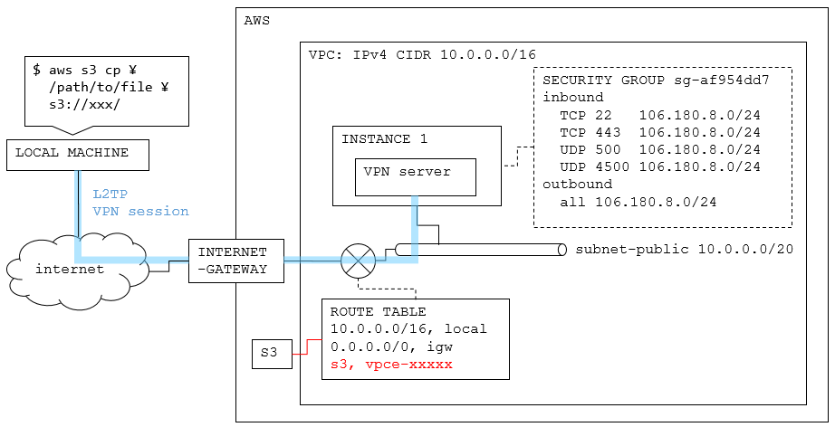

# AWS CloudFormation Template Files

## 1. Dependency

 - [awscli](https://docs.aws.amazon.com/streams/latest/dev/kinesis-tutorial-cli-installation.html)

## 2. How to use

Set up.

```Bash
git clone https://github.com/ncc-ccat-gap/aws_cloud_template.git
cd aws_cloud_template

aws s3 mb <your bucket>
aws s3 cp ./genomon-vpc.yaml s3://<your bucket>
```

Create AWS Virtual Private Cloud (VPC).

```Bash
aws cloudformation create-stack \
  --stack-name <stack name> \
  --template-url https://s3-<region>.amazonaws.com/<your bucket>/genomon-vpc.yaml

## for example,
aws cloudformation create-stack \
  --stack-name genomon-test \
  --template-url https://s3-ap-southeast-1.amazonaws.com/ecsub-singapore/genomon-vpc.yaml

--stack-name (string)
   The  name that is associated with the stack. The name must be unique
   in the region in which you are creating the stack.

   NOTE:
       A stack name can contain only alphanumeric characters (case sen-
       sitive)  and hyphens. It must start with an alphabetic character
       and cannot be longer than 128 characters.

--template-url (string)
   Location of file containing the template body. The URL must point to
   a template (max size: 460,800 bytes) that is located in an Amazon S3
   bucket.  For more information, go to the Template Anatomy in the AWS
   CloudFormation User Guide.

   Conditional: You must specify either the template-body or  the  tem-
   plate-url parameter, but not both.
```

Wait...

```Bash
aws cloudformation describe-stacks --stack-name <stack name> | grep StackStatus

    "StackStatus": "CREATE_IN_PROGRESS",  ## 途中
    "StackStatus": "CREATE_COMPLETE",     ## 成功
    "StackStatus": <other>,               ## 失敗
```

Get SecurityGroup and private-subnet-ID.

```Bash
aws cloudformation describe-stacks --stack-name <stack name> | jq -r ".Stacks[0].Outputs"
[
...
  {
    "Description": "Security group for the jobs",
    "OutputKey": "PrivateSecurityGroup",
    "OutputValue": "sg-6ca00714"
  },
...
  {
    "Description": "Private subnet in the VPC",
    "OutputKey": "PrivateSubnetId",
    "OutputValue": "subnet-fc7d7f9b"
  }
]

```

Delete VPC.

```Bash
aws cloudformation delete-stack --stack-name <value>
```


## 3. VPC List

 - Genomon Cloud (genomon-vpc.yaml)


 - S3-VPN (s3-vpn.yaml) (under development...)



